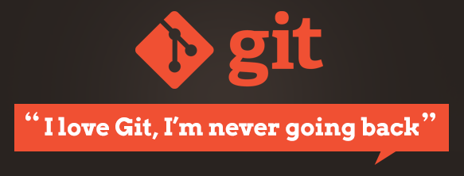
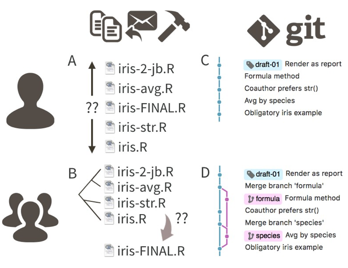
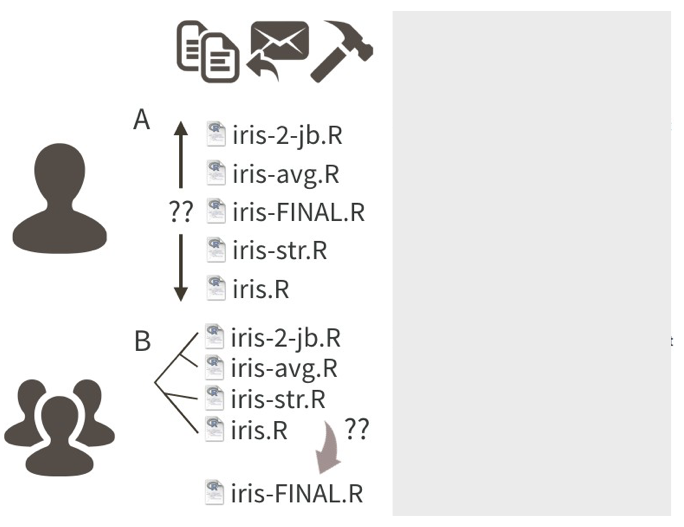
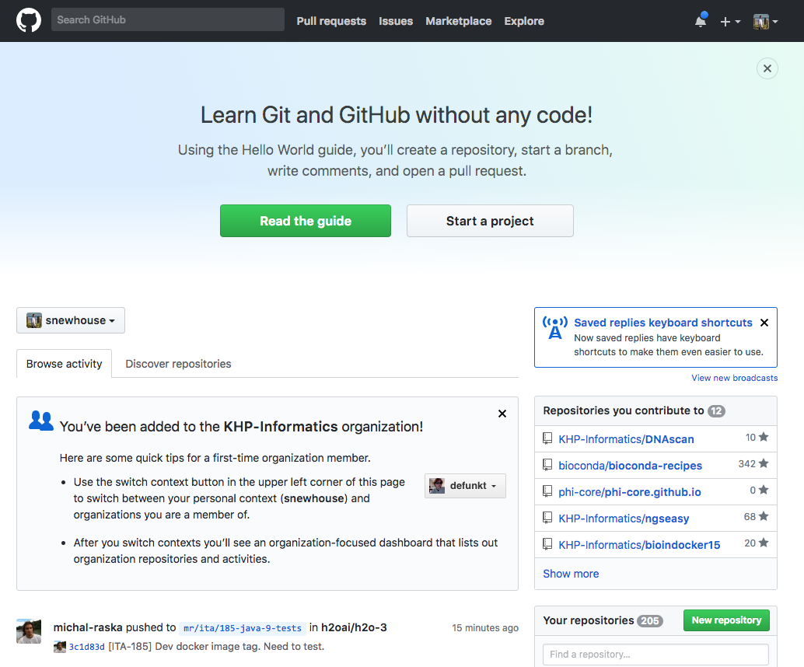
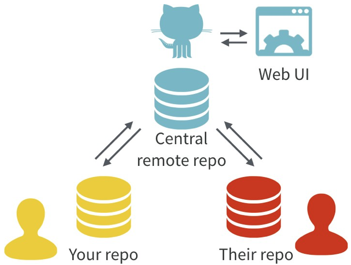

## *How you will all learn to stop worrying about Version Control and learn to love Git and GitHub!*
<small>**All credit to:** Jenny Bryan https://twitter.com/jennybryan. **Excuse me, do you have a moment to talk about version control** [Bryan J](https://twitter.com/jennybryan). Am Stat. 2017;5:1-23.doi:10.7287/peerj.preprints.3159v2</small>

<section></section>

## Overview

- Describes the use of the version control system **Git** and and the hosting site **GitHub** for statistical and data scientific workflows.   
- Do not provide step-by-step instructions on how to use Git and GitHub. 
- Present what the workflow feels like and what the payoffs are, with special attention to the statistics and R context.
- The goal is to help the Git-curious generate the activation energy needed to get started.
- **URL: Git: [https://git-scm.com](https://git-scm.com)**
- **URL: GitHub: [https://github.com](https://github.com)**

## The Problem

- Data analysis, Bioinformatics, statistical research, have at least one thing
in common: these activities all produce many files!
    - Data files, source code, figures, tables, prepared reports, and much more
- Files evolve over the course of a project and often need to be shared with others, for reading or edits
- Without explicit and structured management, project organization can easily descend into chaos, taking time away from the primary work and reducing the quality of the final product.
- This can be avoided by repurposing tools and workflows from the software development world, namely, distributed version control. 


## Why Git?

Why would a statistician use a version control system, such as Git (https://git-scm.com)? 

And what is the point of hosting your work online, e.g., on GitHub (https://github.com)? 

*Could the gains possibly justify the inevitable pain?*

**Oh Yes Indeed!!!**
 
There are many benefits of using hosted version control in your statistical practice:
 
## Why Git?
- **Your work becomes tightly integrated with organizing, recording, and disseminating it** (It’s not a separate, burdensome task you are tempted to neglect).
- **Collaboration** is more structured, with powerful tools for asynchronous work and managing versions.
- Little effort required to **create a web presence for a project**.
- GitHub makes a great **course management system** for courses that use R. You can exchange actual working code with your students and explore the associated results.
- By using common mechanics across work modes (research, teaching, analysis), you achieve basic competence quickly and avoid the demoralizing forget-relearn cycle.

## Now the bad news

- Git was built neither for the exact usage described here, nor for
broad usability. 
- New Git users will notice this, so it’s best to know in advance. 
- Happily, there are many helpful tools that mediate your interactions with Git. 
- **GitHub** itself is a great example, as is **RStudio** (an R Integrated Desktop Environment). 
- In addition to pointing out tools that soften Git’s sharpest edges, *Jenny B recommends* specific habits and attitudes that reduce frustration...

## What is Git?
- Git is a **version control system**.

- Git manages the evolution of a set of files – called a **repository** or **repo** – in a sane, highly structured way.

- Like the “Track Changes” feature from Microsoft Word, but more rigorous, powerful, and scaled up to multiple files.

## Git has been re-purposed by the data science community
- We use it to manage and share a motley collection of files
    - data, figures, reports, and, source code. 
- In a Git-based workflow, you document and, optionally, expose your work as you go. 
- Communication and collaboration are the killer apps of version control.
- Enables the distribution of files across different people, computers, and time

## A hypothetical analysis of the iris data

<section></section>

## Without Git
- Many people who don’t use Git unwittingly re-invent a poor man’s version of it.
    - A single R source file `iris.R` is can become a messy beast to track..
    - Contributors create copies of `iris.R`, appeding the file name with initials, dates, and other descriptors.
    - Leads to multiple versions of `iris.R` of indeterminate relatedness.
    - In collaborative settings based on email distribution, the original file becomes part of a complicated phylogeny that no amount of “Track changes” and good intentions can resolve.

## Without Git

<section></section>
  
## The Git Way   
- The Git way is to track the evolution of `iris.R`
- Through a series of **commits**, each annotated with an explanatory message. 

- In a common collaborative Git workflow, where contributors work independently:
    - Folks sync regularly to a common version 
    - Important versions/changes get a human-readable tag to signal a meaningful milestone.
    - e.g `draft-01`

Yes, there is some pain in adopting the formalism of Git, but it is worth it.

## The Git Way 

<section></section>

## GitHub 1
GitHub is like DropBox or Google Drive, but more structured, powerful, and programmatic.

<section></section>

## GitHub 2
- GitHub complements Git by providing a slick user interface and distribution mechanism for Git repositories
- Git is the software you use locally to record changes to a set of files. 
- GitHub is a hosting service that provides a Git-aware home for such projects on the internet.

<section></section>

## GitHub 3
- With Git, all contributors have a copy of the repo, with all files and the full history. 
- It is typical to stay in sync through the use of a central remote repo, such as GitHub. 
- Hosted remotes like GitHub also provide access to the repo through a web browser.

<section></section>

## GitHub 4

- The remote host acts as the distributor for a Git-managed project.  
- This allows others to browse project files, explore their history, sync up with the current version, and even propose or make changes. 
- Many operations can be done entirely in the browser, including editing or adding files. 
- It is easy to create a hyperlink to a specific file or location in a file, at a specific version, which can make meta-conversations about project code or reports much more productive. 
- GitHub also offers granular control over who can see, edit, and administer a project.

## GitHub Issues 1
- GitHub **Issues** are another powerful feature of the platform. 

- Rember that we are repurposing Git from a tool that facilitates software development.  

- Think of the issues for a project as its bug tracker. 

- For projects that are not pure software development, we co-opt this machinery to organize our to-do list... 

## GitHub Issues 2

- The basic unit is an **Issue** and you can interact with one in two ways:

- First, issues are **integrated into the project’s web interface on GitHub**, with a rich set  of options for linking to project files and incremental changes. 

- Second, issues and their associated comment threads **appear in your email**

- The result is that **all correspondence about a project comes through your normal channels, but is also tracked inside the project itself, with excellent navigability and search capabilities**. 

## GitHub Issues 3
- In **a data analysis project**, you might open an issue to flesh out a specific sub-analysis or to develop a complicated figure. 

- In **a course**, you can use them to manage homework submission, marking, and peer review.

- Issues can be **assigned to specific people** and they can be **labelled**, e.g. “bug”, “simulation-study”, or “final-exam”. 

- Coupled with the ability to cross-link issues and the project files or file changes, you have **extraordinary power to document why things have happened in the past and to organize what needs to happen in the future**.

##	Initial system setup

- Register for a free account with GitHub.
- Install Git. 
    - Depending on your OS, Git might already be installed. 
    - Some basic configuration is needed, such as setting your username and email.
- Install a local Git client - a graphical user interface for Git (optional but highly recommended). 
    - If you are an R user, RStudio provides a great deal of this functionality. 
    - Others: SourceTree or GitKraken.
- Confirm, with a practice repository, that local Git can send and receive the current version of the repository on GitHub, known as pushing and pulling, respectively.

## Some general recommendations for agony reduction

- Consider using a graphical front-end for Git, a.k.a. a Git client, versus restricting yourself to the command line interface.
- Establish confidence in the basics (e.g. make a change, commit it, push it) before wading into more advanced usage (e.g. branching).
- Commit yourself to Git usage on a project that will provide sustained practice over several months.
- *Realize that no one is giving out Git style points. It’s OK to “power-cycle”, i.e. re- initialize the Git repository, to get unstuck.*

## Repositories 

- For new or existing projects, you will: 
    - Dedicate a local directory or folder to it.  
    - Make it an RStudio Project. 
        - Optional but recommended; obviously only applies to projects involving R and users of RStudio.  
    - Make it a Git repository.  

*The project is still a regular directory on your computer, that you can locate, name, move, and generally interact with  as you wish.*  
*You don’t have to handle it with special gloves!*

## Your Daily "Git" workflow
*edit > add > commit > push*

- Go about your usual business, writing R scripts, authoring reports in LaTeX  or R Markdown. 
    - **`add`** the updated files to the git index
    - instead of only saving individual files, periodically make a **`commit`**.
        - takes a snapshot of all the files in the entire project.
    - **`push`** commits to GitHub. This is like sharing a document on DropBox/sending it out as an email. 
    - By pushing to GitHub, you make your work and all your accumulated progress accessible to others.
*This is a moderate change to your normal, daily workflow. It feels weird at first, but quickly becomes second nature.*


## The basic git flow (bash)

A simple example..

```{bash, eval=FALSE }
## make some edits to big-analysis-script.R
sed -i 's/glm/glmnet/g' big-analysis-script.R
## add file to git index (get git to track uodated file)
git add big-analysis-script.R
## commit it: add useful descrption
git commit -m "updated ml workflow to use glmnet"
## push it to guthub
git push
```

- **RStudio will let you do this via a GUI**
    - Make project dir an RStudio Project + initialize git
    - It really is as easy as this!
    - Google "git and RStduio tutorials"..

## Tip of the Iceberg

- A lot more to cover in [**Excuse me, do you have a moment to talk about version control**](https://peerj.com/preprints/3159/) Bryan J. Am Stat. 2017;5:1-23.doi:10.7287/peerj.preprints.3159v2 :
    - Commits, diffs, and tags
    - Markdown is special on GitHub
    - Markdown is special for R users
    - Which files to commit
    - Collaboration
    - Github as a web presence
    - Where to go next
    - Tutorials
    
## Thanks, Questions & Some URLS
- **Git: [https://git-scm.com](https://git-scm.com)**
- **GitHub: [https://github.com](https://github.com)**
- [Reproducible workflow and version control with Git and Github](http://jules32.github.io/2016-07-12-Oxford/git/)
- Google!